# TP COMPUTER GRAPHICS
# ARCBALL
## Partie 1 - Matrices monde
### Exercice 1.1: Implémentation d'une fonction multipliant deux matrices et renvoyant le résultat.
Pour ce premier exercice, j'ai choisi d'écrire une fonction `float *matmul4x4(float *m1, float *m2)`.

Elle prends en paramètre pointeurs de tableaux de floats, en supposant que ces deux tablaeux sont de dimensions 4x4 et effectue la multiplication matricielle. On fait évidemment attention au fait que nous sommes ici dans un mode "colonne d'abord"... 

Cela donne la fonction suivante:
> final.h
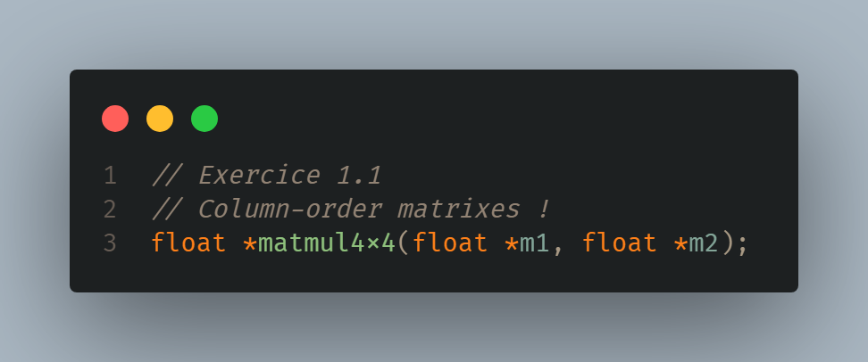

> final.cpp
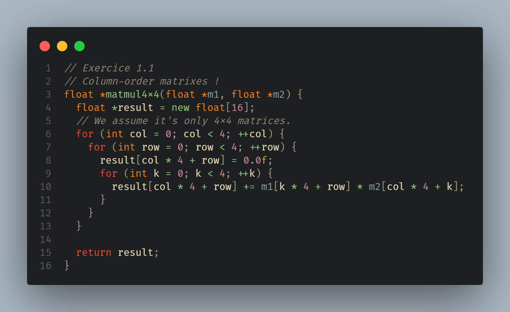

Le principal désavantage de cette solution est que nous devons absolument `delete[]` la valeur retournée après utilisation.

### Exercice 1.2: remplacer vos matrices de transformation locale par une unique transformation locale-vers-monde.
Pour cela, nous avons plusieurs modifications à apporter:

>final.vert
Ajout de `uniform mat4 u_world;` en tant qu'uniform, à la place de matrices individuelles de scaling, rotation...

On peut donc dès à présent remplacer dans l'affectation de gl_Position les anciens appels et finir avec:

`gl_Position = u_proj * u_view 
	* u_world * vec4(a_position, 1.0);`

(On omet de détailler u_proj et u_view pour le moment car il s'agit de l'exercice d'après)

Le remplacement vers une matrice unique est complété du côté du GPU, du côté du CPU nous avons maintenant à calculer cette matrice, et grâce à notre helper `matmul4x4`, on peut donc procéder comme ceci:

> final.cpp
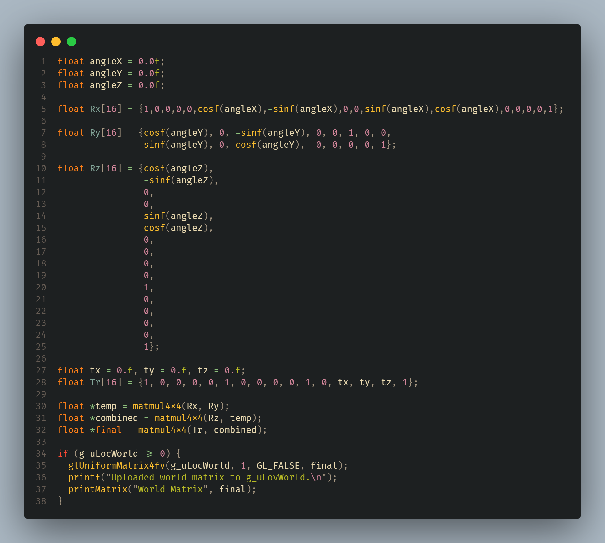

Ce snippet de code est pris depuis la fonction `Initialize()` qui grâce au VAO & VBO permet d'alléger notre fonction `Render()`au maximum comme vu dans les TPs précédents.

Nous avons donc nos 4 matrices Rx,Ry,Rz,Tr (S n'est pas incluse car je n'en avait pas l'utilité au cours de ce TP), que nous combinons grâce à la méthode précédemment écrite et nous l'uploadons ensuite sur le GPU.

Comme la transsformation doit valoir également pour les normales, on modifie l'affectation de `v_Normal` en: 

`v_Normal = normalize(mat3(transpose(inverse(u_world))) * a_normal);`

Remarque: Sachant que nous ne faisons aucune transformation sur l'objet, la matrice World se résume à une matrice identité 4x4... Cela se vérifie dans les logs de notre programme:
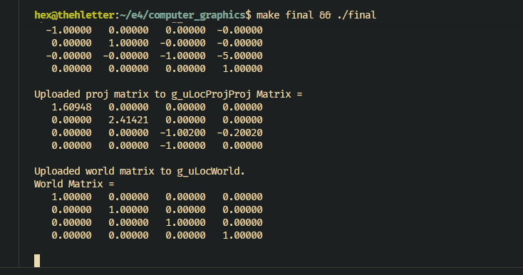

### Exercice 2.1: codez la fonction LookAt(vec3 position, vec3 target, vec3 up) et passez la matrice au Vertex Shader comme View Matrix
A partir de cet exercice la, j'ai décidé d'utiliser une libraire "boilerplate" pour les Vecteurs3, et de l'adapter suivant mes besoins. J'ai donc utilisé [Cette](https://github.com/Gen346/Vector3) librarie en header-only, et ait rajouté les constructeurs dont j'avais besoin.

Par soucis de clarté j'ai également ajouté une struct `Point3` disponible dans common/Point3.h

Afin de coder la fonction LookAt(), il nous suffit de suivre les instructions. Grâce a la struct Vector3, la fonction est donc plutôt petite:

>final.cpp
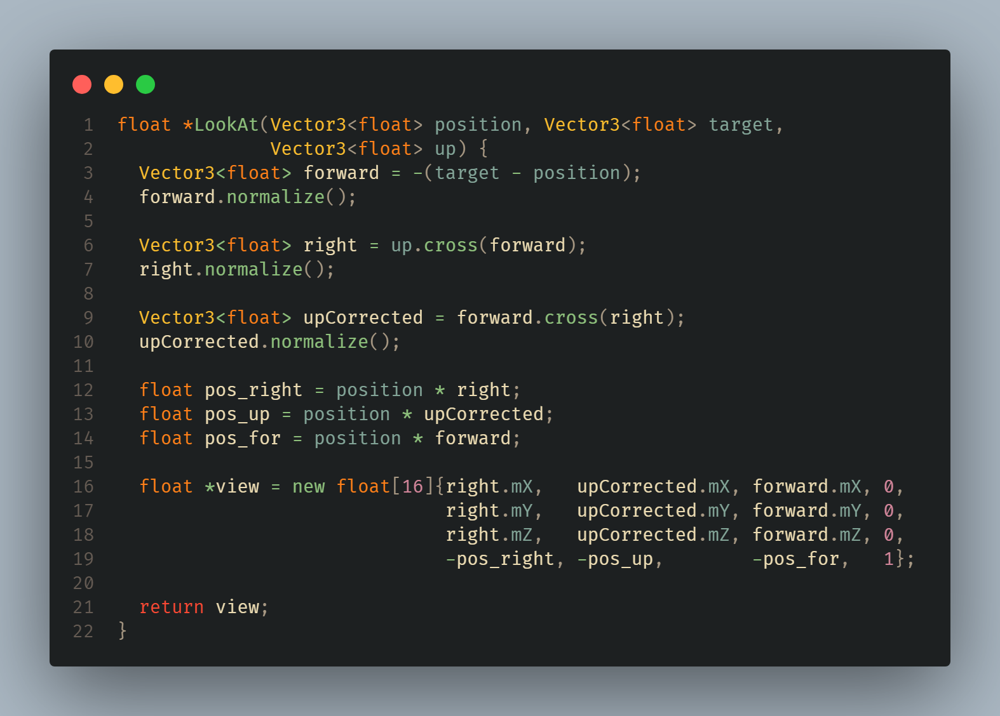

### TP à rendre - Caméra orbitale et Illumination ambiante
On considère dans un premier temps que la caméra est située sur une sphère, par conséquent, 
on initialise les valeurs de notre système sphérique comme ceci:
>final.cpp
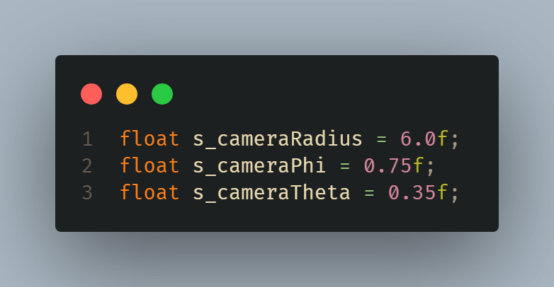

On crée également un helper 
>final.h
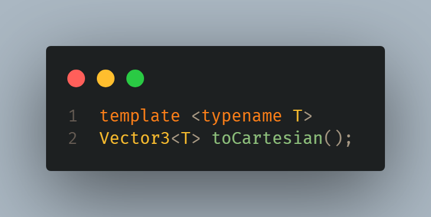

afin de traduire un Vector3 sphérique en cartésien.

Pour un rendu "interactif" Il faut donc dans un second temps mettre à jour la View Matrix grâce à notre nouvelle caméra.

Pour cela, j'ai écrit un helper `updateViewMatrix()` qui est appelé à chaque `Render()` pour inclure les changements induits par les mouvements de souris/molette.

>final.cpp
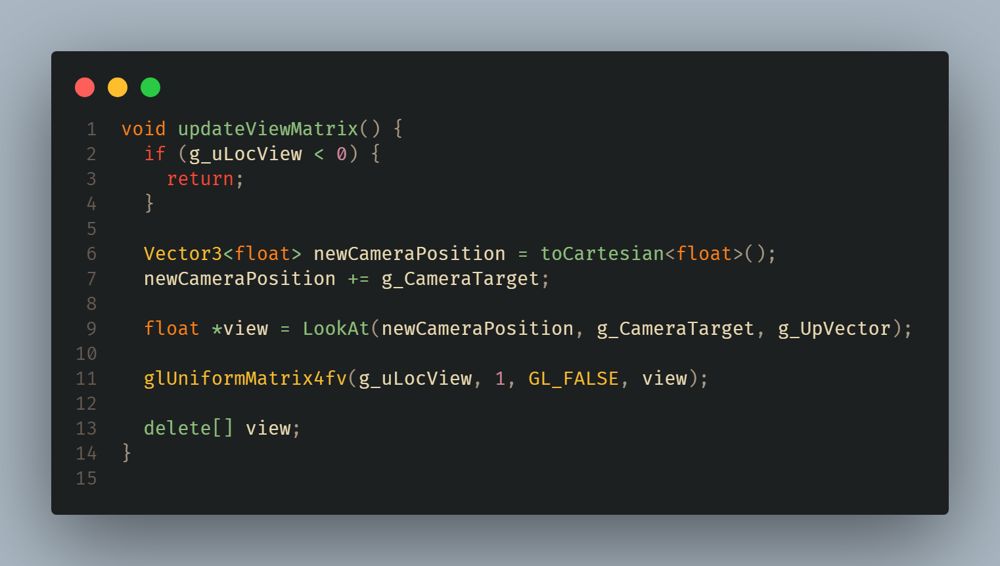

Les vecteurs g_CameraTarget et g_UpVector sont la position de notre objet (ici un cube) et g_UpVector fait référence au vecteur unitaire u_y:

>final.cpp
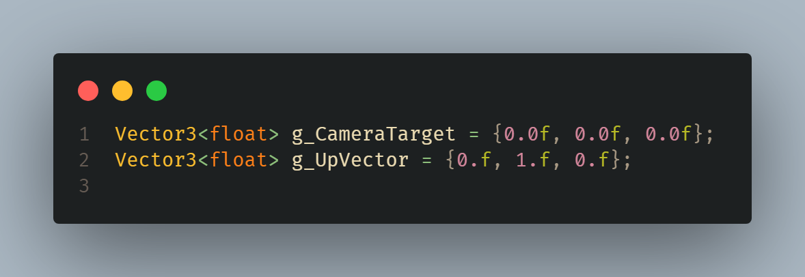

>final
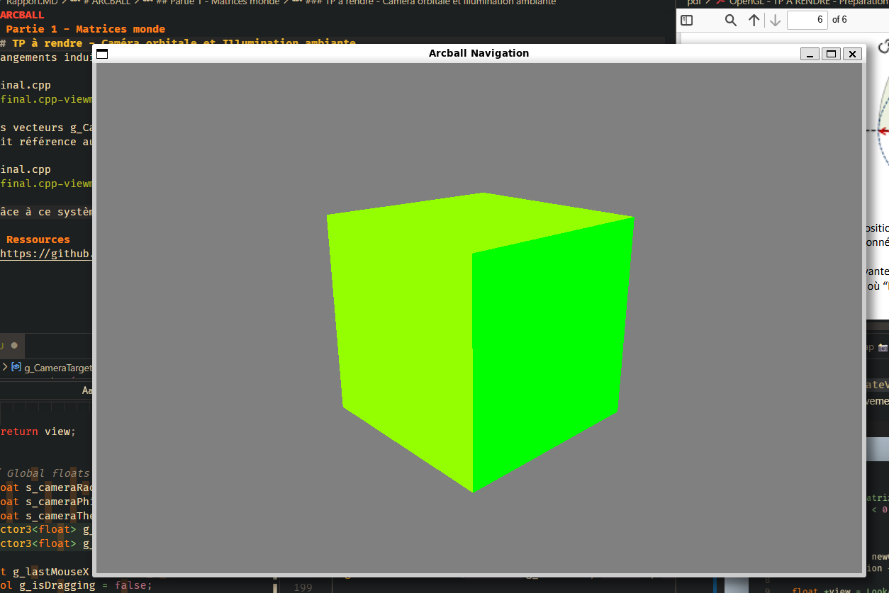
Grâce à ce système, nous avons donc une vue fonctionnelle de notre cube, afin d'ajouter les fonctionnalités de mouvement requise, nous devons donc nous reporter à [cette](https://www.glfw.org/docs/latest/input_guide.html) page afin d'ajouter les différentes composantes requises.

Dans un premier temps, j'ai du basculer l'entièreté de mon programme sur GLFW. En effet, j'ai commencé à l'écrire avec GLUT.

>final.cpp
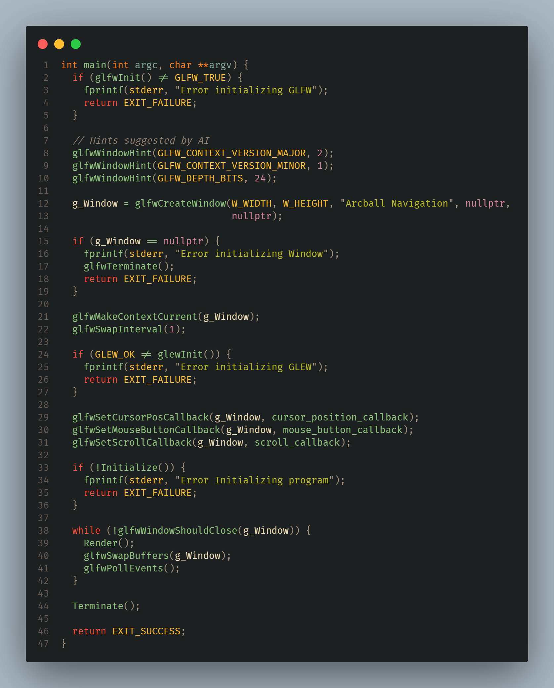

Les lignes importantes ici sont les lignes 29-31 aubsu que 41.

Nous enregistrons des callbacks pour 3 évènements: 
- Lorsque la souris bouge (angle theta et phi affectés)
- Lorsque la molette bouge (Radius affecté)
- Lorsque l'on clique avec le clic gauche (éviter les mouvements intempestifs, clause barrière dans le handler cursor_position_callback)

Ci-dessous les 3 callbacks:
>final.cpp - cursor_position_callback
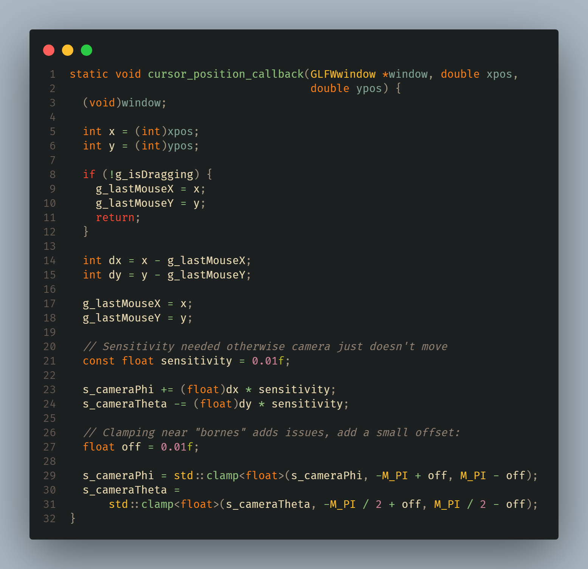

Remarques: 
- `(void)window` sers à supprimer un warning concernant les paramètres non-utilisés
- On utilise deux variables "globales" `g_lastMouseX` et `g_lastMouseY` afin d'enregistrer l'état précédent et calculer un deltaX et deltaY.
- après tests, il s'est avéré qu'une variable `sensitivity` était nécessaire pour baisser la valeur de `s_cameraPhi` & `s_cameraTheta` car sinon on ne voyait tout simplement pas le mouvement, le clamping marchait "trop" bien.
- l'offset `off` sert à éviter les effets de bords aux bornes PI,-PI et PI/2,-PI/2 car j'ai observé des glitchs graphiques quand le mouvement arrivait dans ces zones la.

>final.cpp scroll_callback
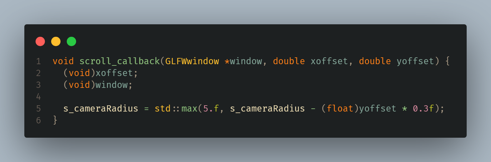

Remarques: 
- On veut éviter de "traverser" l'objet donc on s'assure d'avoir un minimum de 5 unités entre la caméra et le target, qui est (0,0,0). Cela revient à Translater l'objet de quelque unités en arrière (axe -Z) comme vu dans les TP précédents !
- On est obligé d'appliquer un facteur 0.3f car sinon la molette zoom beaucoup trop et on a pas d'entre deux..

>final.cpp mouse_button_callback
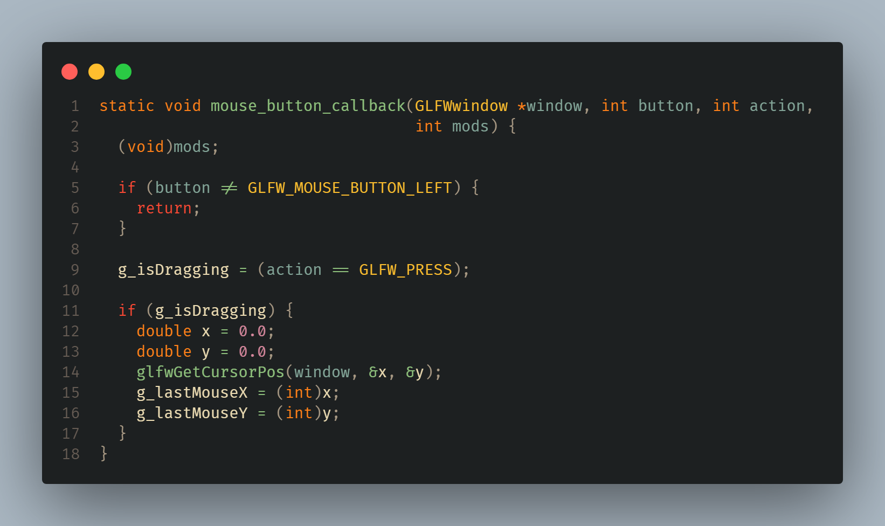

Remarques:
- Ce callback sert uniquement à éviter d'avoir trop de mouvements intempestifs.. Il m'a été suggéré par l'IA afin de rendre mes tests plus simples.

### Résultats finaux:
[Video disponible ici](test-wa.mkv) 

Afin d'obtenir un résultat plus "joli", j'ai appliqué ce que nous avons appris lors du TP de l'illumination. Pour atteindre ce résultat, j'ai du par ailleurs transformer mes shaders.

Nous passons donc de la version 120 à 430. Je me suis aidé des ressources spécifiées dans `Ressources` pour cette migration.

[Video avec illumination (animation sans navigation) disponible ici](test-wa-ill.mkv)

J'ai également décidé d'ajouter un handler pour la touche espace, afin de mettre en pause l'animation que j'effectue. Ce qui rend la navigation en mode "arcball" plus facile à voir.

En dernier lieu, un test avec des textures custom a été réalisé ci-dessous:
[Video avec illumination, texture, navigation, pause disponible ici](test-wa-ill-tex-nav-pause.mkv)

Tout le travail a été réalisé sur Windows 11 avec WSL 2 (Ubuntu).

## Ressources
- https://github.com/Gen346/Vector3
- https://github.com/mattdesl/lwjgl-basics/wiki/GLSL-Versions
